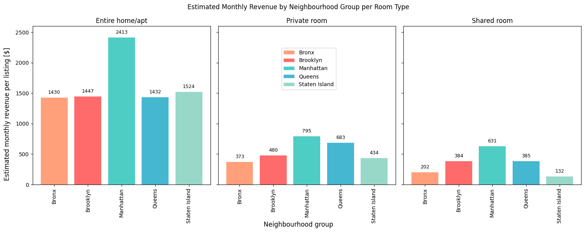

# NYC Airbnb Market Analysis

Exploratory data analysis of Airbnb listings in New York City, focusing on pricing drivers, availability, and estimated revenue across boroughs and room types.

## Project Overview

This project analyzes Airbnb listings in New York City to identify the main factors influencing nightly prices, availability, and estimated monthly revenue. 
The analysis focuses on borough-level and neighborhood-level patterns, as well as differences across room types.

The goal of this project is to demonstrate practical data analysis skills, including data cleaning, exploratory analysis, and the communication of business-relevant insights.

## Dataset

- **Source:** Airbnb NYC Open Data (Kaggle)
- **Observations:** ~49,000 listings before cleaning
- **Key variables:**
  - `neighbourhood_group`
  - `neighbourhood`
  - `room_type`
  - `price`
  - `minimum_nights`
  - `availability_365`
  - `number_of_reviews`

The dataset represents a historical snapshot from the 2010s and does not reflect recent market conditions.

## Methodology

The analysis followed these main steps:

1. Data loading and initial inspection  
2. Data cleaning and preprocessing  
   - Handling missing values  
   - Outlier analysis and treatment (IQR and alternative approaches)  
3. Exploratory Data Analysis (EDA)  
   - Price distribution by borough and room type  
   - Availability and minimum night requirements  
4. Estimation of monthly revenue based on nightly price and minimum stay among others
5. Visualization and interpretation of results

## Key Insights

- Over 85% of listings are concentrated in Manhattan and Brooklyn.
- Manhattan has the highest average nightly price and estimated monthly revenue.
- Entire home/apartment listings are significantly more expensive than private or shared rooms.
- Listings with low availability tend to be associated with higher demand.
- Most listings allow short stays, with two-thirds requiring three nights or fewer.

## Analysis Evidence

### Estimated Monthly Revenue by Neighbourhood Group per Room Type 

  

## Conclusions & Recommendations

Pricing in NYC Airbnb listings is primarily driven by location and room type.
Manhattan stands out as the most attractive market in terms of pricing and revenue potential, while Brooklyn offers a strong alternative with high demand.

From a host or investor perspective, entire home/apartment listings and neighborhoods with low availability appear to offer the strongest revenue opportunities.

## Limitations & Future Work

### Limitations
- The dataset represents a historical snapshot and does not capture recent market changes.
- The estimated monthly revenue is a simplified approximation and does not account for occupancy rates or seasonality.

### Future Work
- Time-series analysis of pricing and demand trends
- Integration of real estate prices to estimate ROI
- Predictive modeling for price estimation and optimization

## Technologies Used

- Python (pandas, numpy, matplotlib, seaborn, scipy)
- Jupyter Notebook
- SQL (for exploratory queries)

## What This Project Demonstrates

- Ability to clean and explore real-world datasets
- Statistical reasoning and outlier treatment
- Data visualization and interpretation
- Translation of data insights into business recommendations
- Clear and structured analytical communication
